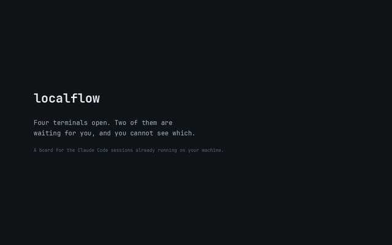

<div align="center">
  
  <h3>A Kanban board for the agent sessions<br>already running on your machine.</h3>
  <p>
    <a href="https://unchained-labs.github.io/localflow/">Docs</a> ·
    <a href="https://unchained-labs.github.io/">Unchained Labs</a> ·
    <code>alpha</code> · <code>MIT</code>
  </p>
</div>

<div align="center">
  
  <br><sub>The dashboard itself, driven by a real server against a machine built for the reel.
  <a href="https://unchained-labs.github.io/localflow/">The full tour →</a> — it also covers reroute, spawn, and what the board refuses.</sub>
</div>

---

You have four terminals open. One is working, two are waiting for an answer you
have not noticed, and one finished an hour ago. Somewhere in there is a session
that has quietly spent more than the rest of the week combined. There is no
view of that.

localflow is the view. It reads the session registry Claude Code already keeps
and the transcripts it already writes, and puts every session on one board with
what it is doing, what it has spent, and whether it is stuck on you.

```sh
git clone https://github.com/Unchained-Labs/localflow
cd localflow && pnpm install && pnpm build
npm i -g .                    # then: localflow
```

Then `localflow` for the board at http://127.0.0.1:7317, or `localflow board`
for the same thing in the terminal.

Nothing is sent anywhere. There is no daemon to install, no config, and no
account — the data is already on your disk, localflow just reads it. The one
exception is a machine you explicitly declare and explicitly ask it to watch, and
even then it connects over your own ssh to a host you named. See
[Devices](#devices-and-sessions-that-survive-the-train-tunnel).

## What it shows

```
  localflow  7 session(s) · 1.9M out · 738.9M cached in · $593
             98% of input tokens came from cache

  running (2)

    Build whitespace agent workflow tooling in unchained-labs
      graph-claude-46 · opus-5 · 660k out · $184 · 99% cached · 38s
      ~/dev/graph-claude · last: Bash · 23 tool errors

  waiting on you (3)

    create a new repo for socials where we will have private docs …
      wardn-22 · opus-5 · 839k out · $328 · 97% cached · 2d
      ~/dev/bench2clanker · claude/bench2baller-mt167r · last: Bash
```

Four lanes, and the mapping is deliberately dull because every interesting
version of it involves guessing:

| Lane | What it means |
| :--- | :--- |
| **running** | The registry says `busy`. The model is working. |
| **queued** | Idle with prompts enqueued and not started. |
| **waiting on you** | Idle with an empty queue. It wants an answer. |
| **ended** | Gone from the registry. |

**There is no "done" lane.** Nothing on your disk records whether a session
achieved what it was asked to do — only that it stopped. A board that rendered
"ended" as "went well" would be inventing the one fact you most want, which is
the same defect [authsweep](https://github.com/Unchained-Labs/authsweep) calls a
false clean, wearing a green tick.

## Cost, and why it is right

The board prices every session from the token counts in its transcript. Getting
that right took two corrections that are worth stating, because both of them
would have been invisible:

**Usage is re-emitted as a message streams.** The same `usage` object appears up
to ten times, byte identical, once per streamed update. Summing every line
inflated output tokens **2.25×** on a real 17MB transcript. Counting once per
message id is exact, not approximate — every duplicate was identical.

**Cache writes are billed by TTL.** A 1-hour cache write costs 2× the input rate;
a 5-minute one costs 1.25×. Claude Code writes 1-hour entries, so a single
1.25× multiplier under-prices a real session by about a third. This is not a
guess: `claude -p --output-format json` reports `total_cost_usd` for the run it
just did, which makes it an oracle.

```
  531 input + 22188 cache-read + 3026 cache-write(1h) + 51 output, haiku
  1.25x -> $0.0067873000
  2.00x -> $0.0090568000
  CLI   -> $0.0090568000
```

The test suite re-runs that check against a captured fixture, so a rate change
fails the build instead of quietly changing your bill. Where no price is known
for a model the card says **cost unknown**, never `$0.00` — the first is a fact,
the second is a lie.

## Other tools, without guessing at them

The Claude Code reader is a real parser, and it is real because everything in it
was checked against a machine that has Claude Code on it. Codex CLI, Gemini CLI,
Aider and OpenCode are not on that machine. Writing four scrapers for their
formats from memory would produce four files that look like support and are
actually guesses — and a guess that parses something is worse than no adapter,
because it puts a number on the board.

So localflow does not guess the shape. You describe it, once, in
`~/.localflow/sources.json`:

```json
{ "sources": [{
    "id": "codex",
    "root": "~/.codex/sessions",
    "fields": {
      "model": "model", "input": "usage.input_tokens",
      "output": "usage.output_tokens", "messageId": "id"
    }
}]}
```

Those cards then sit on the same board, in the same lanes, with the same rules.
The one field worth getting right is `messageId` — tools that stream re-emit the
same usage object, and summing every line inflated output tokens 2.25× on a real
Claude transcript. Leave it out and the board says so rather than quietly
inflating your totals. Full guide: [`docs/sources.md`](docs/sources.md).

### You do not have to write that by hand

```sh
localflow sources            # what is on this machine, and how it could be read
localflow sources --write    # put it in sources.json
```

It looks in the usual places, and where it finds a tool it **reads one of that
tool's actual files** and reports the paths that were in it. Nothing in the
suggestion is remembered from anywhere — if `tokens.cache.read` comes back, it
is because those bytes are on your disk — so the output is a hypothesis you can
check in one command against what the tool itself reports. That is a thing you
can do and this repo cannot.

```
  + opencode
      ~/.local/share/opencode/storage/message  412 file(s)
      derived from .../ses_01k9/msg_003.json
        input      tokens.input
        output     tokens.output
        model      modelID
```

A tool it finds but cannot derive token fields for says so and lists the keys it
did see, rather than emitting a source that produces free-looking cards.
Existing declarations are never overwritten: you checked those against the tool,
and a fresh guess replacing them would undo the one act of verification in the
whole flow.

### Two layouts, because one of them fails silently

`layout: "jsonl"` (the default) is one record per line, one file per session.
`layout: "json"` is one record per **file**, with the session being the
directory they sit in — which is how opencode stores things
(`storage/message/<sessionID>/msg_<id>.json`).

That distinction is not cosmetic. Read a pretty-printed object line by line and
*no* line parses, so the source probes fine, finds its files, and produces a
card with zero tokens and no cost. Not an error — a zero. localflow now names
that case and tells you which layout to declare.

### What cannot be read at all, and why

- **Cursor** keeps its conversations in SQLite (`state.vscdb`, a key/value table
  of JSON blobs with a `-wal` file alongside), not in files this adapter can
  read. Worth knowing before you go looking: Cursor stores that database on the
  machine running its UI *even when you are working over Remote-SSH*, so a
  watched device would not have it either.
- **Aider** writes Markdown next to the repo it edited
  (`.aider.chat.history.md`), with no token counts in a form this adapter can
  total. It reports usage to your terminal, and that is the number to trust.

`localflow sources` says both of these by name. "localflow does not show my
Cursor sessions" deserves an answer better than silence.

### Telling them apart on the board

Once more than one tool has a card, every card gets a two-character badge —
`cc`, `oc`, `cx` — and the terminal board prints the key underneath. Below that
threshold there is no badge, because a column of `cc` down a Claude-only board
tells you something you knew before you opened it.

It is a monogram rather than a colour, and that was measured rather than
preferred. Any two cards can end up adjacent, so the pairlist that matters is
*all pairs*; under it a perceptual hue wheel supports **three** categories that
stay apart for a red-green colourblind reader. At four, two collide
(normal-vision ΔE 13.7 against a floor of 15); at six the worst pair reaches ΔE
3.2 under protanopia — two different tools, one colour. There are already more
than three plausible sources. So `color` in sources.json is **yours** to set if
you want one; nothing here ships a scheme it cannot defend.

## Prices you can check

The Anthropic table is in the repo and CI asserts it against
[preflight](https://github.com/Unchained-Labs/preflight), so a rate change fails
the build. That guarantee cannot extend to anyone else's rate card — nothing
here watches OpenAI's pricing page — so other vendors' rates are **data you
supply**, in `~/.localflow/pricing.json`, with the date you last checked them.
The board shows how stale that is, because a price table with no age on it is
indistinguishable from a correct one.

Until you supply a rate, those cards show tokens and no dollar figure. Same rule
as always: **cost unknown, never `$0.00`.**

Models served from your own hardware — LeHarness on a Spark, Ollama on a laptop —
are priced at **0**, and that zero is a different claim from the `null` above.
There is no per-token bill. The bill was the machine.

## Metrics

```sh
localflow metrics | jq .totals
```

Or the **Metrics** tab: spend and sessions over time, tokens by model, by tool
and by project, the observed fan-out histogram, and tool-call counts. Two rules
the charts follow, both about omission rather than arithmetic:

- **An unpriced session is excluded from spend and hatched on the chart**, never
  folded in as zero. A flat line through a period that actually cost something
  is the failure mode worth engineering against.
- **A bucket nothing landed in is still drawn**, because dropping it turns a
  quiet week into a straight line between two busy ones.

Six categorical hues, validated for colour-vision separation and contrast
against this app's own surfaces. A seventh series is never a new hue — it folds
into a labelled neutral.

### Burn rate and the five-hour block

```sh
localflow metrics | jq '.burn, .currentBlock'
```

Anthropic's usage limits reset on rolling **five-hour blocks**, so "spent today"
is the wrong denominator — midnight is not a thing the limit knows about. A
block opens with the first session after the previous one closed and its start
is floored to the hour, which is upstream's rule and not a rounding
convenience: sessions at 09:30 and 12:30 are one block starting 09:00, where
fixed five-hour slabs cut from the epoch would report two. The board shows what
the current block has cost, how long until it resets, and where it lands if you
keep going.

Beside it, spend and tokens per hour over the last hour and the last 24. A rate
is the only figure here that is an extrapolation rather than a sum, so each one
carries what it was extrapolated from:

- **The denominator is what the board could see, not the window.** Three
  minutes of history is three minutes, and the tile says so rather than quietly
  presenting `$3` as `$3/h`.
- **Unpriced work has no rate at all.** A window in which nothing could be
  priced reports `unknown`, never `$0.00/h`; a partly-priced one is prefixed
  `≥`, because it is a floor. Token rates survive either way — tokens are
  counted, not looked up.
- **A projection needs a quarter-hour of block behind it.** Under that, there
  is no projected figure, only the reason there isn't one.
- **A session is billed to its last activity**, since a card carries one
  cumulative total and one timestamp rather than a spend curve. A nine-hour
  session therefore lands entirely in the window it last touched; those are
  counted and labelled `bunched` instead of being smoothed over.

## Water

Every answer evaporates real freshwater — cooling towers on-site, power plants
off-site. localflow already has the token counts, so it hands them to
[soif](https://github.com/Unchained-Labs/soif) and shows the answer next to the
dollars:

```sh
localflow water

  271 L (range 23 L – 3133 L) of freshwater

  claude-opus-5            271 L (range 23 L – 3131 L)
  claude-opus-4-8          111 mL (range 9.27 mL – 1.3 L)
```

**localflow does no water arithmetic of its own**, and that is the point. soif's
factors are versioned, sourced, and calibrated against Google's measured Gemini
figures, Epoch AI's GPT-4o analysis and Mistral's Large 2 LCA. A second
implementation living here would be wrong within a release and wrong silently —
the same duplication this ecosystem has already paid for twice.

Three things travel with the number:

- **The range, always.** Published per-prompt figures span two orders of
  magnitude (0.26 mL for a median Gemini prompt; 45 mL for a 400-token Mistral
  Large 2 response). A bare midpoint would discard the only honest part.
- **An assumed tier, flagged.** When soif has no factors for a model it picks a
  capability tier and says so. Tier is worth ~30x across the range, so those
  rows are drawn hollow and named — a number resting on a guess is a different
  claim from one resting on published figures.
- **Sessions with no recorded model, excluded and counted.** They never reach
  soif at all; a placeholder handed over as a model name would come back with a
  confident-looking estimate for work we cannot attribute to anything.

No soif installed means no water section — not a section full of zeroes:

```sh
uv tool install git+https://github.com/Unchained-Labs/soif
```

(soif's README says `pip install soif-llm`; that distribution is not on PyPI yet,
so the git URL is the one that works today.)

## Every session, not just the recent ones

The board keeps a bounded history on purpose; a machine with a year of sessions
behind it should not open onto a scrollable archive. "Show me everything" is a
different question:

```sh
localflow sessions            # every transcript on disk, plus the live registry
localflow sessions chezmoi    # filtered
localflow tasks <sessionId>   # that session's task list
```

## Tasks

Claude Code keeps a task list per session under `~/.claude/tasks/`. localflow
reads it onto the card and can add to it (`--allow-actions`). There is
deliberately no delete: the agent may be working from that list right now, and
removing an item under it is the one edit that could make a session act on a
task that no longer exists.

## Running it as a service

```sh
make up                          # build, serve on 127.0.0.1:7317, detached
make up ACTIONS=1 ROOTS=~/dev    # ...and permit spawn/reprompt/stop under ~/dev
make down / make logs / make status
```

It runs on the host, not in a container, and that is not an oversight: it needs
`~/.claude/sessions` (mode 0700) and the `claude` binary on PATH.

## The graph that actually ran

[graphlint](https://github.com/Unchained-Labs/graphlint) lints the workflow you
*wrote*. That is the easy half: a spec is a statement of intent, and intent is
not what your bill is made of.

Every fan-out Claude Code performs is in the transcript — which agents were
issued together, how wide the group got, which came back with an error. So the
graph can be reconstructed after the fact and handed to the same tools:

```sh
localflow graph f60740f7 > observed.graph.json
graphlint check observed.graph.json     # lint the run you already paid for
preflight estimate observed.graph.json  # price the next one like it
```

Agent calls sharing an assistant message ran concurrently; calls in separate
messages ran one after another. So the grouping *is* the graph, and each
sequence is emitted as a barrier with `observed:` in its reason — a measurement,
not an opinion about whether the barrier was needed. That question is
graphlint's, and now it has real graphs to ask it about.

localflow adds only the observations that need the measured numbers to be
sayable at all — three verifiers whose prompts are 100% alike, a fan-out where
children failed, a session running at a 12% cache hit rate. It does not
duplicate graphlint's rule set, because two rule sets eventually disagree.

### One command instead of the pipe

That pipe was a line in a README telling you to run three tools by hand.
`localflow review` is the same pipe with the plumbing on this side:

```sh
localflow review f60740f7
```

```
  Reconstruct the fan-out a session actually performed
  4 fan-out(s), 10 agent(s), widest 5

  graphlint 0.1.0  1 error(s), 4 warning(s), 0 info
    ✗ correlated-verifiers: These two verifiers ask the same question (100% prompt overlap).
    ! missing-schema: Agent "session" returns free text but its result feeds another step.
      (a transcript does not record whether a subagent was given an output schema, so an
       observed graph never has one to show)

  preflight 0.1.0
    agents    56 expected (41–116)
    predicted $1.55 ($1.00–$3.74)
    measured  $100.40
```

**Nothing here is reimplemented.** The spec goes out on stdin, the JSON comes
back, and localflow renders what it is told — the same argument as soif. Three
rules travel with it:

- **Absent is absent, never clean.** A missing `graphlint` reports "not
  installed", never "no findings". A linter that reports zero problems because
  it never ran is the false clean this whole family argues against, and it is
  the easiest one to ship by accident.
- **A non-zero exit is an answer.** `graphlint check` exits 1 when a rule fires.
  Reading exit codes as failure would discard exactly the runs worth reading.
- **What the transcript cannot record is said out loud.** An observed graph has
  no output schemas because a transcript does not record whether a subagent was
  given one. graphlint correctly reports `missing-schema` on every node; that
  finding is about localflow's input rather than about your session, and it
  carries a note saying so instead of being filtered away behind your back.

### The gap is the interesting number

`predicted $1.55, measured $100.40` is not preflight being wrong. preflight's
`worker` profile means *one unit of work* and defaults to 8k input; an
interactive session's context is the whole conversation, and by call two hundred
that is 332k. The two numbers are different quantities, and seeing them side by
side is what tells you the profile needs measuring rather than guessing — which
is what `localflow calibrate` writes.

### What it will not ask decorrelate

[decorrelate](https://github.com/Unchained-Labs/decorrelate) measures whether a
panel of verifiers was actually independent, from their **verdicts**. localflow
does not have verdicts. A transcript records which agents were issued and which
returned a tool error; it does not record what any of them concluded, and an
error is not a "no". So `decorrelate report` is not wired up, and the reason is
printed rather than left as an absence you might read as an endorsement.

What is wired up is the other verb. When a fan-out is caught asking one question
three times, `decorrelate lenses` plans a set of deliberately different ones —
and a plan needs no run data:

```
  decorrelate 0.1.0 — a generic lens plan for that panel
    refute    opus-5    Try to refute this. Default to refuted if you are uncertain.
    evidence  sonnet-5  Quote the exact span that supports this. Paraphrase is a rejection.
    impact    haiku-4-5 If this is real, what breaks, for whom, and how would they notice?
```

It defaults to `generic` on purpose: decorrelate has domain-specific plans, and
picking between them from a transcript would be localflow guessing what your
session was for. Pass your own with `decorrelate lenses <domain>`.

All three tools are optional. Each one absent is one section that says it is
absent, and the rest of the board is unaffected:

```sh
npm i -g graphlint preflight-cost decorrelate
```

## Workflows: the graph you write

Everything above is instrumentation — it watches a fleet and reconstructs what
it did. This is the other half: a graph you compose, that localflow runs.

```sh
localflow workflows          # what is in ~/.localflow/workflows
localflow run audit          # lint it, price it, then run it
```

Or the **Workflows** tab: pick one, see it as a graph, click a node to edit its
prompt, model, effort, directory and fan-out width, then check, save and run it
while the nodes light up.

A workflow is a `*.graph.json` — **the same document graphlint lints and
preflight prices**, with the fields execution needs added to each node. That is
the whole reason the format is shared: you can lint and price a fleet before it
spends a token, using the tools that already do those jobs.

```json
{
  "name": "audit",
  "cwd": "~/work/billing",
  "budget": { "usd": 12 },
  "nodes": [
    { "id": "scope",  "prompt": "List every billing route and what authorises it.", "model": "sonnet" },
    { "id": "verify", "prompt": "Given:\n{{input}}\n\nLens {{index}} of {{width}}: find one authorisation gap.",
      "model": "opus", "fanout": { "over": "agents", "width": 3 } },
    { "id": "report", "prompt": "Write the findings up as a PR description:\n{{input}}" }
  ],
  "edges": [
    { "from": "scope",  "to": "verify", "barrier": true, "barrierReason": "the panel needs the route list" },
    { "from": "verify", "to": "report", "barrier": true, "barrierReason": "the write-up waits for every lens" }
  ]
}
```

**One node is one `claude -p --output-format json` run.** `--bg` returns the
moment a session registers and never reports that it finished, so a graph built
on it could not have dependencies — you cannot wait for something that never
says it is done. Headless blocks, reports the `session_id` it created, and
reports what the CLI itself says the turn cost, so a finished node carries a
**measured** figure. The sessions it starts are normal sessions: they land on
the board, and can be opened, priced and graphed afterwards like any other.

Edges are dependencies. `{{input}}` is replaced by the output of the nodes a
node depends on, and that substitution is the only data flow there is — what you
read in the prompt is what was sent.

### What it refuses

- **A node whose dependency failed is `skipped`, never `completed`**, and the
  run names the upstream node that did it. Rolling a skip up as success is how
  an orchestrator tells you it did work it did not do.
- **One failed child fails its node.** Downstream asked for that node's output;
  a partial panel is not the thing it asked for.
- **Cycles are refused before anything starts**, with the loop named.
- **Every directory goes through the same allowed-roots check as spawn.** A
  workflow is a file, and a file that could name any directory would make
  `--allow-root` decorative.
- **graphlint errors and a blown preflight budget stop the run** — overridable
  with `--force`, which still prints what the gate said.
- **An absent tool skips its gate and says so.** Everywhere else in this repo a
  false clean costs you a wrong number; here it costs you a fleet of agents
  doing the wrong thing.

Running is behind `--allow-actions`, like every other verb that starts a
session. Reading and editing a workflow is not — composing a graph is editing a
file.

## Calibrating preflight

[preflight](https://github.com/Unchained-Labs/preflight)'s `calibrate` replaces
guessed token profiles with medians from real runs, and is careful about the one
thing it does not do:

> It does not invent a cache hit rate. Usage rows do not report cache reads, so
> there is nothing to derive one from.

True of the rows it had. A Claude Code transcript reports
`cache_read_input_tokens` and a `cache_creation` object split by TTL — so on this
machine the cache hit rate is a measurement. And it is the assumption a cost
model is most sensitive to: cache reads are ~98% of input tokens on a real
session and bill at a tenth of the rate.

```sh
localflow calibrate > preflight.json
```

```
  measured across 11 session(s), 900 model call(s)

  cacheHitRate          97.9%   measured, not assumed

  reported, not written:
    input per call       332,433   p10–p90 27,648–1,070,519
    output per call        2,413
```

**Only the rate is written, and that is the interesting part.** preflight's
`worker` profile means *one unit of work* and defaults to 8k input. An
interactive session measures 332k per call, because by call two hundred the
context *is* the conversation. Both numbers are correct and they are not the
same quantity — writing the second into the first would be a forty-fold error
wearing the authority of a measurement, which is exactly the failure preflight's
own refusals exist to prevent. The token statistics are printed for you to read;
`--tokens` writes them anyway if your workload really is shaped like your
sessions.

It refuses below three sessions, for the same reason preflight refuses below
five records: a profile from two runs carries the authority of a measurement and
the accuracy of a guess.

## Orchestrating

Off by default. localflow watches; it steers only when asked:

```sh
localflow --allow-actions --allow-root ~/dev
```

| Verb | What it runs |
| :--- | :--- |
| **spawn** | `claude --bg -p <prompt>` — a background agent, in a directory you allowed |
| **reprompt** | `claude --resume <id> -p <prompt>` — another turn on the same session |
| **reroute** | `claude --resume <id> --fork-session --model <m>` — the same conversation, a different model |
| **stop** | `SIGINT` to the session's pid, which is what Ctrl-C sends |

Every verb is a documented Claude Code flag. There is a fifth thing a board like
this obviously wants — inject a prompt into a session that is mid-turn — and it
is **deliberately absent**. Each live session has a Unix socket under
`/run/user/<uid>/cc-socks/`, and driving it would mean reverse-engineering an
undocumented protocol that can change in any release. So `reprompt` on a busy
session refuses and tells you to fork instead. A tool that steers your agents
through a private channel is a tool that silently stops steering them one
Tuesday.

Dragging a card asks for the action that would put it in that lane. Most moves
have no such action — you cannot drag a session into *running*, because what
makes a session run is having something to do — and the lane refuses in red and
says why rather than snapping the card back.

## Devices, and sessions that survive the train tunnel

Claude Code dies when its ssh connection does. The kernel sends SIGHUP to the
controlling terminal's process group on disconnect and the session goes with it,
which is why a dropped connection has historically cost you the work rather than
just the view of it. (Anthropic issue #49790.)

The fix is tmux, which owns the session independently of any terminal, so the
hangup lands on the client and the process keeps running. localflow can start
those sessions for you on machines you have declared:

```json
// ~/.localflow/devices.json
{
  "devices": [
    { "name": "spark", "host": "spark.example.ts.net", "cwd": "~/work" },
    { "name": "nuc",   "host": "nuc.example.ts.net", "user": "you", "bin": "/opt/bin/claude" }
  ]
}
```

Then start the board with `--allow-remote`, which is a separate flag from
`--allow-actions` on purpose: steering an agent on this machine and starting a
process on a different one are not the same permission.

Three rules this feature does not bend:

**No credentials, ever.** Authentication is whatever your ssh already does --
agent, key, certificate. ssh runs with `BatchMode=yes`, so a host that would
prompt for a password fails and says so instead. A device carrying a `password`,
`key` or `token` field is *refused outright*, not quietly loaded without it,
because loading it would work against a key-based host and leave the secret
sitting in a file in your home directory.

**Devices are declared, never supplied.** The HTTP surface has no `host`
parameter anywhere. Callers name a device and the host comes from the file. A
board that accepted a hostname in a request body would be an ssh client with a
web front end.

**Prompts never touch a command line.** Whatever you type is base64-encoded,
decoded into a file on the far side, and read back inside `"$(cat ...)"`, whose
result the shell does not re-parse. The tests execute the generated script
against a real shell with hostile prompts -- backticks, `$(...)`, embedded
quotes and newlines -- and assert both that the bytes arrive intact and that
nothing ran.

Sessions localflow starts are prefixed `lf-`, and it will only list or kill that
prefix, so your own tmux sessions on those machines are not its business.

Attaching is a command you run yourself:

```
ssh -t spark.example.ts.net tmux attach -t lf-refactor
```

The board shows you that line rather than proxying a terminal. Holding a PTY
open from a web server to another computer is a larger promise than this feature
is making.

**Requirements on the far side:** `tmux` and `claude` on PATH. The devices panel
says which one is missing rather than failing opaquely. Note this only keeps the
*process* alive -- Claude Code's Remote Control has a network timeout of its own,
and nothing here changes that.

### Watching them, not just firing into them

Starting work on a machine you cannot then see is half a feature. `--watch-remote`
puts every declared device's sessions on the same board as the local ones, in the
same lanes, with the same token counts and the same price:

```
localflow --watch-remote
```

```
  running (4)

    @spark Audit the billing routes and open a PR with the fixes
      billing-audit · sonnet-5 · 133k out · $7.76 · 83% cached · 4m
```

It is a **separate flag from `--allow-remote`**, both off by default, because
they are different things to agree to. Watching copies transcripts here;
spawning starts processes there. Either without the other is a reasonable thing
to want -- a build box you fire work at but do not want mirrored, a fleet you
only ever read -- and a device can opt out of the board alone with
`"monitor": false`.

**The transcript is mirrored, not summarised.** Each device's transcripts are
copied incrementally into `~/.localflow/mirror/<device>/` and then parsed by
exactly the same reader as a local one. The alternative -- running a summariser
on the far side -- means a second implementation of the counting rules in
`transcript.ts`, and a cost that is right locally and quietly wrong remotely is
worse than no remote support at all.

That does mean **another machine's prompts end up on this disk**. It is why this
is its own flag, why the mirror directory is created `0700`, and why
`/api/health` tells you where it is.

The conversation is two ssh calls per device per poll, not one per session: a
manifest (the registry, and a stat of every transcript), then one framed stream
carrying the bytes that were appended to the files that actually grew. Nothing
changed means nothing transferred. Connections are multiplexed, so steady-state
polls reuse one handshake, and devices are polled on their own timer -- one
asleep laptop must not hold up the local board for its `ConnectTimeout`.

Four things it will not do:

**A machine that stops answering does not empty its lane.** Its cards stay, faded
and dashed, each labelled `unreachable · last seen 4m ago`. The session did not
stop existing when the lid closed, and a board that deletes cards on a dropped
connection teaches you to distrust the board.

**A partial mirror is never priced as a whole one.** The first sync of a very
large transcript takes its tail rather than surprising you with the transfer, and
those cards are marked `cost is a floor` -- the same rule that makes an unpriced
model read `cost unknown` rather than `$0.00`.

**What comes back from a device is not trusted.** Session ids and paths are the
one input here we did not write. They are checked against a strict pattern and
confined to the root we asked about before they are quoted into anything, and the
framed stream is read by declared byte count, so a transcript containing the
frame marker cannot desynchronise the reader. Both are tested by executing the
generated script against a real shell.

**Two machines cannot merge.** A card's identity includes its device, so the same
session id on a cloned home directory stays two cards rather than one card with
both costs added together. `reprompt`, `reroute` and `stop` refuse a remote card
by name: they act on this machine, and resuming an id that is not here would
either fail confusingly or match the wrong session.

## Safety

This process can start Claude Code sessions on your machine, and a page on the
open internet can point your browser at `127.0.0.1`. Three things stop that:

- **Actions are off** without `--allow-actions`. Every mutating route answers 403.
- **`Host` is checked.** DNS rebinding resolves an attacker's hostname to
  127.0.0.1, and the give-away is that the browser still sends their name.
- **`Origin` is checked.** A cross-site POST carries the originating site; ours
  carries ours; curl sends none.

Bound to loopback unless you say otherwise, and saying otherwise prints a
warning. CI asserts all four refusals on every commit.

## Otter

Set `LOCALFLOW_OTTER_URL` and jobs from an
[Otter](https://github.com/Unchained-Labs/otter) instance appear on the same
board. localflow watches the machine you are sitting at; Otter runs jobs
somewhere else. On one board, "what is running right now" finally has one
answer. Otter's own cost figure is preferred where it has one, because it was
produced by the system that ran the job.

## Install

```sh
git clone https://github.com/Unchained-Labs/localflow
cd localflow && pnpm install && pnpm build
npm i -g .                    # then: localflow
```

It publishes as `@unchained-labs/localflow`. The bare name `localflow` on npm
belongs to an unrelated package, so `npx localflow` installs somebody else's
code — install from the repo until the scoped package is up.

Needs Node 22 and `claude` on your `PATH`. Set `LOCALFLOW_CLAUDE_BIN` if it
lives somewhere unusual.

| Flag | Effect |
| :--- | :--- |
| `--port N` | Default 7317. |
| `--host ADDR` | Default `127.0.0.1`. Anything else exposes this to your network. |
| `--allow-actions` | Permit spawn / reprompt / reroute / stop. |
| `--allow-root PATH` | Restrict `spawn` to a directory. Repeatable. |
| `--history N` | Ended sessions to keep on the board. Default 10. |
| `--poll MS` | Refresh interval. Default 2000. |
| `--otter URL` | Federate with an Otter instance. |
| `--format text\|json` | For `board`, `graph` and `calibrate`. |

## What it does not do

- **It cannot tell you whether a session succeeded.** That is not recorded
  anywhere it can read, so it does not guess.
- **It reads Claude Code only.** Not Cursor, not Aider, not the API directly.
  The board is built on `claude agents --json` and the transcript layout, and
  neither is a published schema — both were derived from a real installation, and
  a future version could move them.
- **Tool errors are not failures.** A `tool_result` with `is_error` is routine —
  a grep that matched nothing, a command that exited 1. The count is shown; no
  card is marked broken for it.
- **The graph is shape, not intent.** It can see that a barrier happened. It
  cannot see whether one was needed.
- **History is capped.** Ten ended sessions by default; a machine with a year of
  transcripts should not turn the board into an archive.

## Development

```sh
pnpm install && pnpm build && pnpm test   # 216 tests
node dist/src/cli.js board
node dist/src/cli.js --allow-actions
```

The fixtures are captured from a real installation: `headless-result.json` is an
actual `claude -p --output-format json` result, and it is what the cost test
checks the arithmetic against. `transcript.jsonl` reproduces every line type the
reader handles, including a message emitted three times and a line that is not
JSON at all.

The mark is generated, not drawn: `python3 tools/mkmark.py` computes the lane
pitch from the grid so the gutters are equal by construction.

### The demo reel

```sh
make demo          # rebuilds docs/assets/demo.{mp4,gif} and the stills
```

Four pieces, and the first one is the interesting one:

- **`tools/fixture.mjs`** writes a machine — transcripts, a session registry,
  another tool's sessions, three declared devices — into a directory, and prints
  the environment that points localflow at it. Nothing is stubbed inside the
  product: `CLAUDE_CONFIG_DIR`, `LOCALFLOW_SOURCES`, `LOCALFLOW_HOME` and a
  `claude`/`ssh` pair on `PATH` are the whole of it.
- **`tools/capture.mjs`** drives a real Chrome against a real server over the
  DevTools Protocol, performs the interactions a person would, and saves a frame
  plus the on-screen rectangle worth zooming into after each one.
- **`tools/mkdemo.py`** composites those frames with captions. The MP4 is the
  full tour; the GIF above is the subset that still reads at 640px, because it
  has to load inside this README.
- `make demo` runs all three on their own port and Chrome profile, so a
  localflow you are already using is not disturbed.

The reel used to be shot against the author's own laptop, which meant nobody
else could rebuild it and every shipped feature made it staler. **The captions
are claims about the fixture** — "ten agent calls in four groups" is true
because `fixture.mjs` writes exactly that, so a number changed there is a
caption to change here.

## Licence

MIT. Part of [Unchained Labs](https://unchained-labs.github.io/) — see also
[graphlint](https://github.com/Unchained-Labs/graphlint),
[preflight](https://github.com/Unchained-Labs/preflight),
[decorrelate](https://github.com/Unchained-Labs/decorrelate) and
[authsweep](https://github.com/Unchained-Labs/authsweep).
