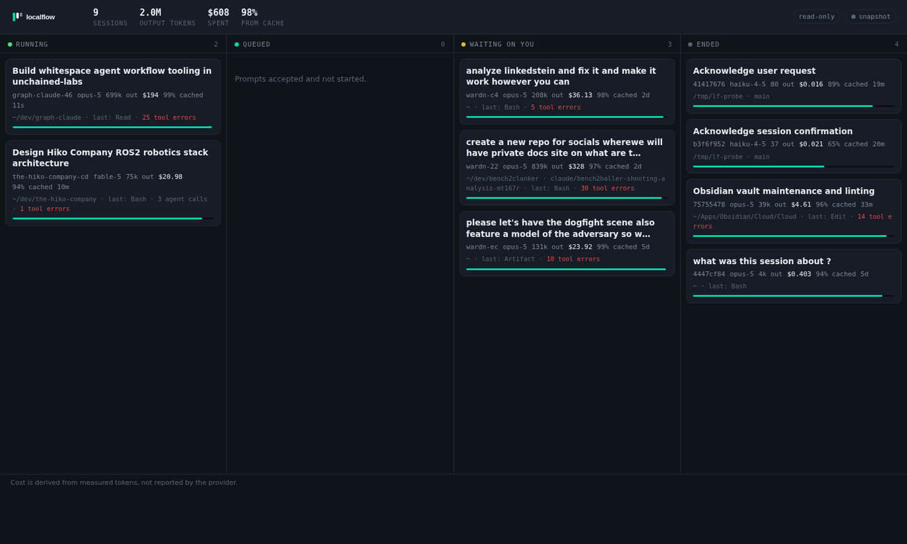

<div align="center">
  
  <h3>A Kanban board for the Claude Code sessions<br>already running on your machine.</h3>
  <p>
    <a href="https://unchained-labs.github.io/localflow/">Docs</a> ·
    <a href="https://unchained-labs.github.io/">Unchained Labs</a> ·
    <code>alpha</code> · <code>MIT</code>
  </p>
</div>

<div align="center">
  
</div>

---

You have four terminals open. One is working, two are waiting for an answer you
have not noticed, and one finished an hour ago. Somewhere in there is a session
that has quietly spent more than the rest of the week combined. There is no
view of that.

localflow is the view. It reads the session registry Claude Code already keeps
and the transcripts it already writes, and puts every session on one board with
what it is doing, what it has spent, and whether it is stuck on you.

```sh
npx localflow                 # http://127.0.0.1:7317
npx localflow board           # the same thing, in the terminal
```

Nothing is sent anywhere. There is no daemon to install, no config, and no
account — the data is already on your disk, localflow just reads it.

## What it shows

```
  localflow  7 session(s) · 1.9M out · 738.9M cached in · $593
             98% of input tokens came from cache

  running (2)

    Build whitespace agent workflow tooling in unchained-labs
      graph-claude-46 · opus-5 · 660k out · $184 · 99% cached · 38s
      ~/dev/graph-claude · last: Bash · 23 tool errors

  waiting on you (3)

    create a new repo for socials where we will have private docs …
      wardn-22 · opus-5 · 839k out · $328 · 97% cached · 2d
      ~/dev/bench2clanker · claude/bench2baller-mt167r · last: Bash
```

Four lanes, and the mapping is deliberately dull because every interesting
version of it involves guessing:

| Lane | What it means |
| :--- | :--- |
| **running** | The registry says `busy`. The model is working. |
| **queued** | Idle with prompts enqueued and not started. |
| **waiting on you** | Idle with an empty queue. It wants an answer. |
| **ended** | Gone from the registry. |

**There is no "done" lane.** Nothing on your disk records whether a session
achieved what it was asked to do — only that it stopped. A board that rendered
"ended" as "went well" would be inventing the one fact you most want, which is
the same defect [authsweep](https://github.com/Unchained-Labs/authsweep) calls a
false clean, wearing a green tick.

## Cost, and why it is right

The board prices every session from the token counts in its transcript. Getting
that right took two corrections that are worth stating, because both of them
would have been invisible:

**Usage is re-emitted as a message streams.** The same `usage` object appears up
to ten times, byte identical, once per streamed update. Summing every line
inflated output tokens **2.25×** on a real 17MB transcript. Counting once per
message id is exact, not approximate — every duplicate was identical.

**Cache writes are billed by TTL.** A 1-hour cache write costs 2× the input rate;
a 5-minute one costs 1.25×. Claude Code writes 1-hour entries, so a single
1.25× multiplier under-prices a real session by about a third. This is not a
guess: `claude -p --output-format json` reports `total_cost_usd` for the run it
just did, which makes it an oracle.

```
  531 input + 22188 cache-read + 3026 cache-write(1h) + 51 output, haiku
  1.25x -> $0.0067873000
  2.00x -> $0.0090568000
  CLI   -> $0.0090568000
```

The test suite re-runs that check against a captured fixture, so a rate change
fails the build instead of quietly changing your bill. Where no price is known
for a model the card says **cost unknown**, never `$0.00` — the first is a fact,
the second is a lie.

## The graph that actually ran

[graphlint](https://github.com/Unchained-Labs/graphlint) lints the workflow you
*wrote*. That is the easy half: a spec is a statement of intent, and intent is
not what your bill is made of.

Every fan-out Claude Code performs is in the transcript — which agents were
issued together, how wide the group got, which came back with an error. So the
graph can be reconstructed after the fact and handed to the same tools:

```sh
localflow graph f60740f7 > observed.graph.json
graphlint check observed.graph.json     # lint the run you already paid for
preflight estimate observed.graph.json  # price the next one like it
```

Agent calls sharing an assistant message ran concurrently; calls in separate
messages ran one after another. So the grouping *is* the graph, and each
sequence is emitted as a barrier with `observed:` in its reason — a measurement,
not an opinion about whether the barrier was needed. That question is
graphlint's, and now it has real graphs to ask it about.

localflow adds only the observations that need the measured numbers to be
sayable at all — three verifiers whose prompts are 100% alike, a fan-out where
children failed, a session running at a 12% cache hit rate. It does not
duplicate graphlint's rule set, because two rule sets eventually disagree.

## Calibrating preflight

[preflight](https://github.com/Unchained-Labs/preflight)'s `calibrate` replaces
guessed token profiles with medians from real runs, and is careful about the one
thing it does not do:

> It does not invent a cache hit rate. Usage rows do not report cache reads, so
> there is nothing to derive one from.

True of the rows it had. A Claude Code transcript reports
`cache_read_input_tokens` and a `cache_creation` object split by TTL — so on this
machine the cache hit rate is a measurement. And it is the assumption a cost
model is most sensitive to: cache reads are ~98% of input tokens on a real
session and bill at a tenth of the rate.

```sh
localflow calibrate > preflight.json
```

```
  measured across 11 session(s), 900 model call(s)

  cacheHitRate          97.9%   measured, not assumed

  reported, not written:
    input per call       332,433   p10–p90 27,648–1,070,519
    output per call        2,413
```

**Only the rate is written, and that is the interesting part.** preflight's
`worker` profile means *one unit of work* and defaults to 8k input. An
interactive session measures 332k per call, because by call two hundred the
context *is* the conversation. Both numbers are correct and they are not the
same quantity — writing the second into the first would be a forty-fold error
wearing the authority of a measurement, which is exactly the failure preflight's
own refusals exist to prevent. The token statistics are printed for you to read;
`--tokens` writes them anyway if your workload really is shaped like your
sessions.

It refuses below three sessions, for the same reason preflight refuses below
five records: a profile from two runs carries the authority of a measurement and
the accuracy of a guess.

## Orchestrating

Off by default. localflow watches; it steers only when asked:

```sh
localflow --allow-actions --allow-root ~/dev
```

| Verb | What it runs |
| :--- | :--- |
| **spawn** | `claude --bg -p <prompt>` — a background agent, in a directory you allowed |
| **reprompt** | `claude --resume <id> -p <prompt>` — another turn on the same session |
| **reroute** | `claude --resume <id> --fork-session --model <m>` — the same conversation, a different model |
| **stop** | `SIGINT` to the session's pid, which is what Ctrl-C sends |

Every verb is a documented Claude Code flag. There is a fifth thing a board like
this obviously wants — inject a prompt into a session that is mid-turn — and it
is **deliberately absent**. Each live session has a Unix socket under
`/run/user/<uid>/cc-socks/`, and driving it would mean reverse-engineering an
undocumented protocol that can change in any release. So `reprompt` on a busy
session refuses and tells you to fork instead. A tool that steers your agents
through a private channel is a tool that silently stops steering them one
Tuesday.

Dragging a card asks for the action that would put it in that lane. Most moves
have no such action — you cannot drag a session into *running*, because what
makes a session run is having something to do — and the lane refuses in red and
says why rather than snapping the card back.

## Safety

This process can start Claude Code sessions on your machine, and a page on the
open internet can point your browser at `127.0.0.1`. Three things stop that:

- **Actions are off** without `--allow-actions`. Every mutating route answers 403.
- **`Host` is checked.** DNS rebinding resolves an attacker's hostname to
  127.0.0.1, and the give-away is that the browser still sends their name.
- **`Origin` is checked.** A cross-site POST carries the originating site; ours
  carries ours; curl sends none.

Bound to loopback unless you say otherwise, and saying otherwise prints a
warning. CI asserts all four refusals on every commit.

## Otter

Set `LOCALFLOW_OTTER_URL` and jobs from an
[Otter](https://github.com/Unchained-Labs/otter) instance appear on the same
board. localflow watches the machine you are sitting at; Otter runs jobs
somewhere else. On one board, "what is running right now" finally has one
answer. Otter's own cost figure is preferred where it has one, because it was
produced by the system that ran the job.

## Install

```sh
npx localflow                  # no install
npm i -g localflow             # or keep it around
```

Needs Node 22 and `claude` on your `PATH`. Set `LOCALFLOW_CLAUDE_BIN` if it
lives somewhere unusual.

| Flag | Effect |
| :--- | :--- |
| `--port N` | Default 7317. |
| `--host ADDR` | Default `127.0.0.1`. Anything else exposes this to your network. |
| `--allow-actions` | Permit spawn / reprompt / reroute / stop. |
| `--allow-root PATH` | Restrict `spawn` to a directory. Repeatable. |
| `--history N` | Ended sessions to keep on the board. Default 10. |
| `--poll MS` | Refresh interval. Default 2000. |
| `--otter URL` | Federate with an Otter instance. |
| `--format text\|json` | For `board`, `graph` and `calibrate`. |

## What it does not do

- **It cannot tell you whether a session succeeded.** That is not recorded
  anywhere it can read, so it does not guess.
- **It reads Claude Code only.** Not Cursor, not Aider, not the API directly.
  The board is built on `claude agents --json` and the transcript layout, and
  neither is a published schema — both were derived from a real installation, and
  a future version could move them.
- **Tool errors are not failures.** A `tool_result` with `is_error` is routine —
  a grep that matched nothing, a command that exited 1. The count is shown; no
  card is marked broken for it.
- **The graph is shape, not intent.** It can see that a barrier happened. It
  cannot see whether one was needed.
- **History is capped.** Ten ended sessions by default; a machine with a year of
  transcripts should not turn the board into an archive.

## Development

```sh
pnpm install && pnpm build && pnpm test   # 62 tests
node dist/src/cli.js board
node dist/src/cli.js --allow-actions
```

The fixtures are captured from a real installation: `headless-result.json` is an
actual `claude -p --output-format json` result, and it is what the cost test
checks the arithmetic against. `transcript.jsonl` reproduces every line type the
reader handles, including a message emitted three times and a line that is not
JSON at all.

The mark is generated, not drawn: `python3 tools/mkmark.py` computes the lane
pitch from the grid so the gutters are equal by construction.

## Licence

MIT. Part of [Unchained Labs](https://unchained-labs.github.io/) — see also
[graphlint](https://github.com/Unchained-Labs/graphlint),
[preflight](https://github.com/Unchained-Labs/preflight),
[decorrelate](https://github.com/Unchained-Labs/decorrelate) and
[authsweep](https://github.com/Unchained-Labs/authsweep).
